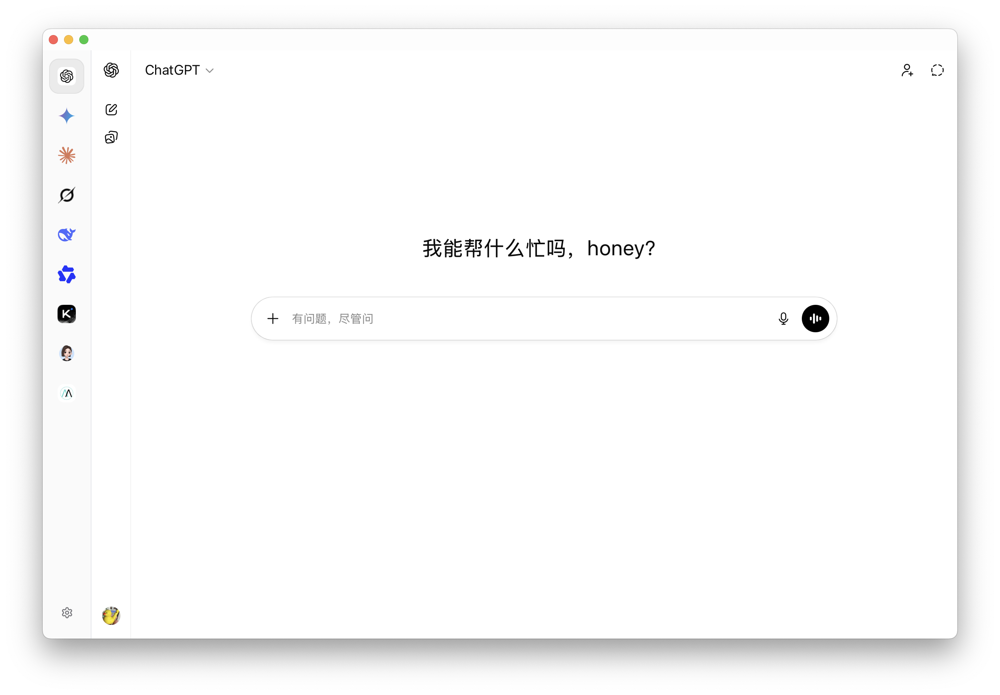

  

<h1 align="center">AnyChat</h1>

  <strong>多 AI Chat 聚合桌面客户端</strong>

  
  
  
  
  

AnyChat 是一个聚合了多个 AI 聊天服务的桌面应用，旨在提供统一入口与低占用的桌面端体验。它让你能在一个窗口中无缝切换不同的 AI 服务，专注于高性能、轻量化的日常使用。

如果您需要更强大的聊天数据本地获取和管理功能，推荐使用：

## 界面

## ✨ 核心特性

- **🚀 多服务聚合**: 统一管理 ChatGPT, Gemini, Claude 等 12+ 种主流 AI 服务。
- **⌨️ 效率优先**: 支持快捷键快速切换服务，极简的 UI 设计。
- **⌨️ 性能优先**: 高性能、低占用，基于 Tauri，安装包大小仅 7 MB。

## 规划

- [x] 多入口聊天 Chat 聚合
- [x] 支持自定义网站 chat
- [x] 自动获取网站 logo
- [x] google 账号授权登录
